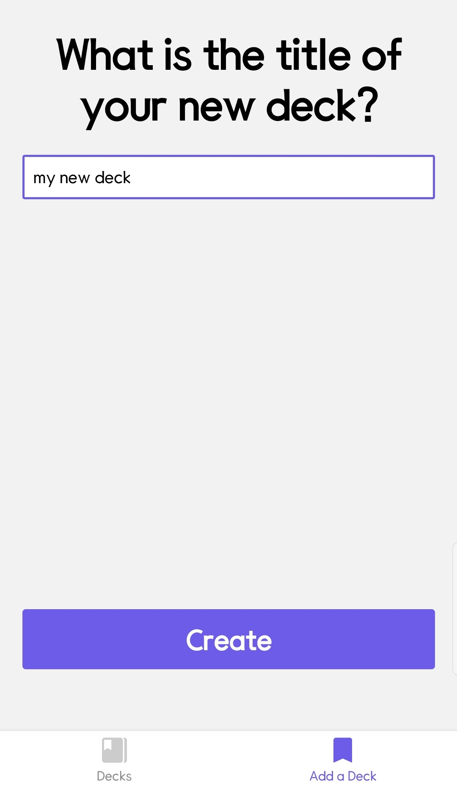
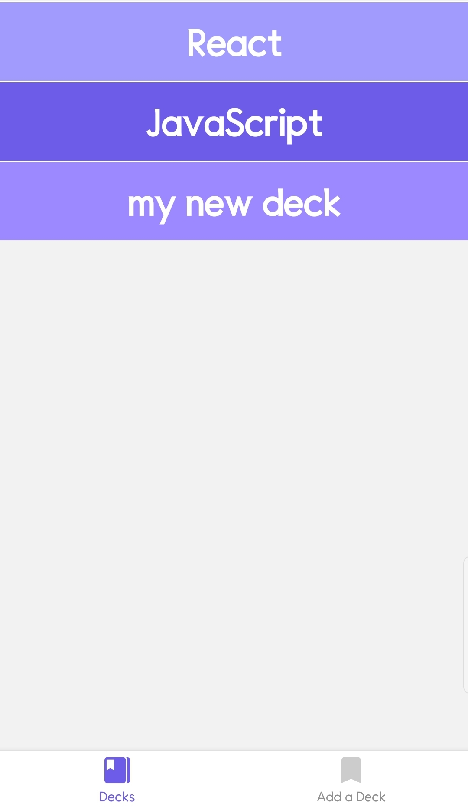
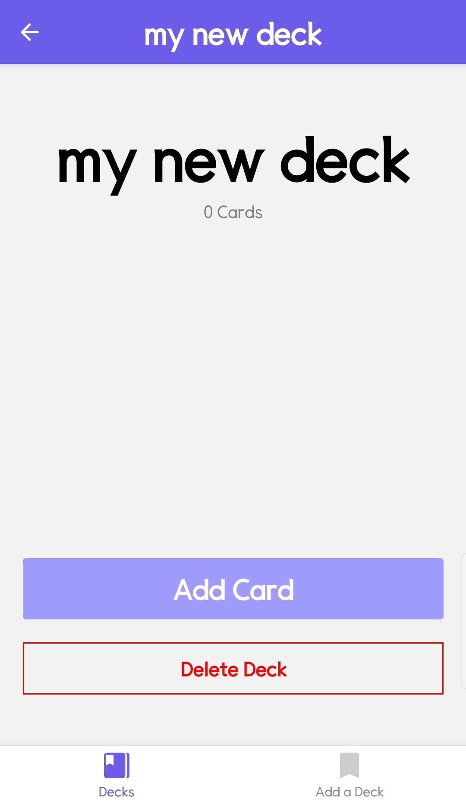
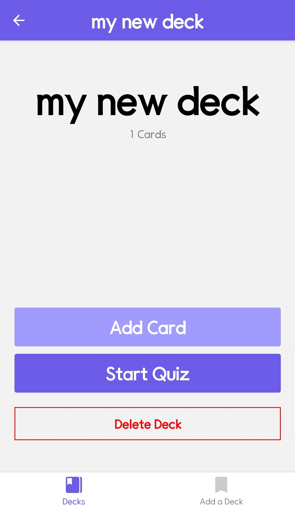
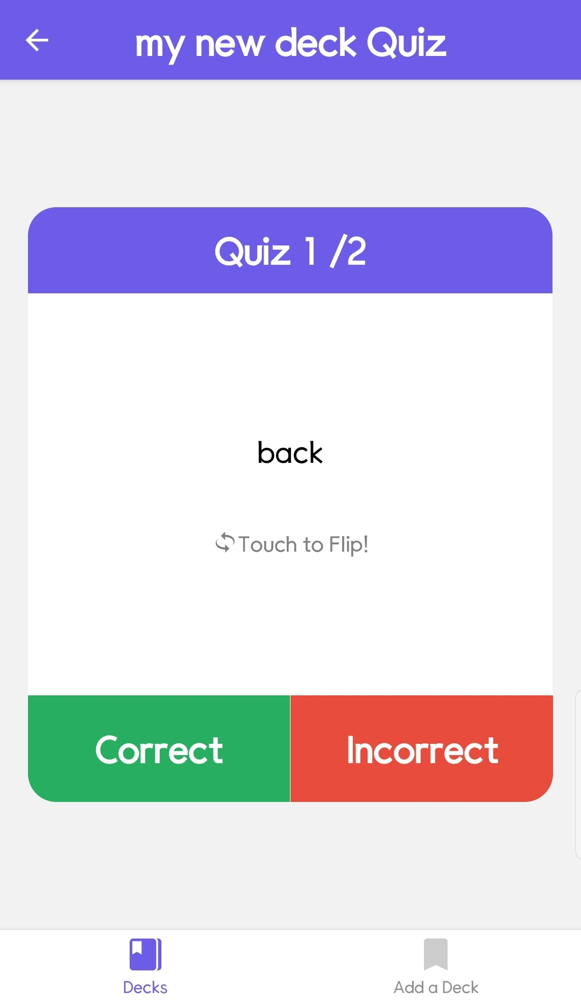
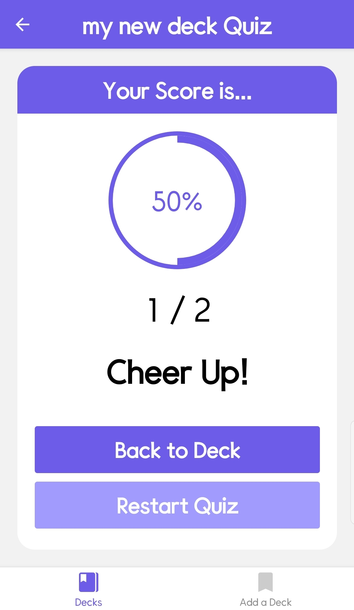

# ⚛Udacity React Nanodegree Project - Mobile Flashcards🎫

This repo is a code-along with the first project in the [React Nanodegree program](https://www.udacity.com/course/react-nanodegree--nd019).

## 📌Table of Contents

- [⚛Udacity React Nanodegree Project - Mobile Flashcards🎫](#udacity-react-nanodegree-project---mobile-flashcards)
  - [📌Table of Contents](#table-of-contents)
  - [💻Tested Envirionment](#tested-envirionment)
  - [🔰Project Setup](#project-setup)
  - [📷Screenshots](#screenshots)
  - [👨‍💻Features](#features)

## 💻Tested Envirionment

- [x] `Android OS`
- [ ] `ios`
  -  NOT TESTED
- [ ] `Web`

## 🔰Project Setup

- clone the Project - `git clone https://github.com/CaesiumY/reactnd-mobile-flashcards.git`
- install the dependencies - `yarn install`
- start a local server - `yarn start`
- Open with `Local Device` or `Your Device` on `Android OS`

## 📷Screenshots

    
Add Deck

        

    
Home - Decks

        

    
Deck Screen - No Cards

        

    
Deck Screen - With Cards

        

    
Add Card

        

    
Quiz - Front

        

    
Quiz - Back

        

    
Score

        

## 👨‍💻Features

- [x] Add Deck
- [x] Delete Deck
- [x] Add Card
- [x] Solve Quiz
- [x] View Score
- [x] Push Local Notification(at 8pm)
